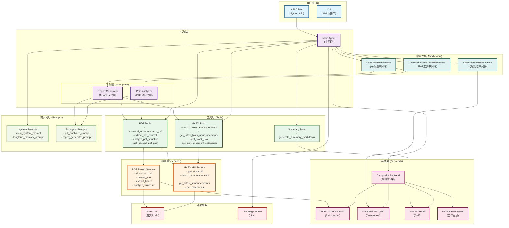

# HKEX Agent 架构图

## 架构说明

### 1. 用户接口层
- **CLI**: 命令行接口，提供交互式终端界面
- **API Client**: Python API客户端，支持程序化调用

### 2. 代理层
- **Main Agent**: 主代理，基于 DeepAgents 框架构建
- **PDF Analyzer**: 专门用于PDF内容分析的子代理
- **Report Generator**: 专门用于生成结构化报告的子代理

### 3. 工具层
- **HKEX Tools**: 港交所公告搜索和信息获取工具
- **PDF Tools**: PDF下载、提取和分析工具
- **Summary Tools**: Markdown摘要生成工具

### 4. 服务层
- **HKEX API Service**: 封装港交所API调用逻辑
- **PDF Parser Service**: PDF解析和处理服务

### 5. 存储层
- **Composite Backend**: 复合后端，根据路径前缀路由到不同的存储后端
- **PDF Cache Backend**: PDF文件缓存存储
- **Memories Backend**: 代理长期记忆存储
- **MD Backend**: Markdown摘要文件存储
- **Default Filesystem**: 默认文件系统后端

### 6. 中间件层
- **AgentMemoryMiddleware**: 加载和注入代理记忆到系统提示词
- **ResumableShellToolMiddleware**: 可恢复的Shell命令执行中间件
- **SubAgentMiddleware**: 子代理调用中间件（由DeepAgents框架创建）

### 7. 外部服务
- **HKEX API**: 港交所官方API
- **Language Model**: 大语言模型（LLM）

### 8. 提示词层
- **System Prompts**: 主代理和长期记忆的系统提示词
- **Subagent Prompts**: 子代理专用的系统提示词

## 数据流

1. **用户请求** → CLI/API → Main Agent
2. **Main Agent** → 根据任务类型选择工具或子代理
3. **工具调用** → 服务层 → 外部API/本地处理
4. **结果返回** → 存储层 → 工具 → 代理 → 用户
5. **记忆管理** → AgentMemoryMiddleware → Memories Backend → System Prompt

## 关键特性

- **模块化设计**: 清晰的层次分离，便于维护和扩展
- **子代理架构**: 通过专门的子代理处理特定任务
- **智能缓存**: PDF文件自动缓存，避免重复下载
- **记忆持久化**: 代理记忆保存在文件系统中，支持长期对话
- **路径路由**: Composite Backend根据路径前缀自动路由到不同存储后端

